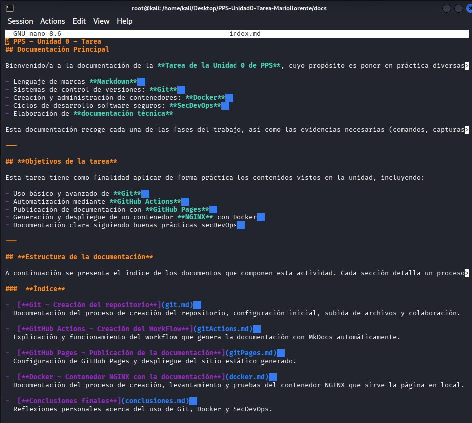
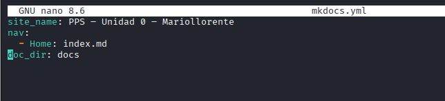
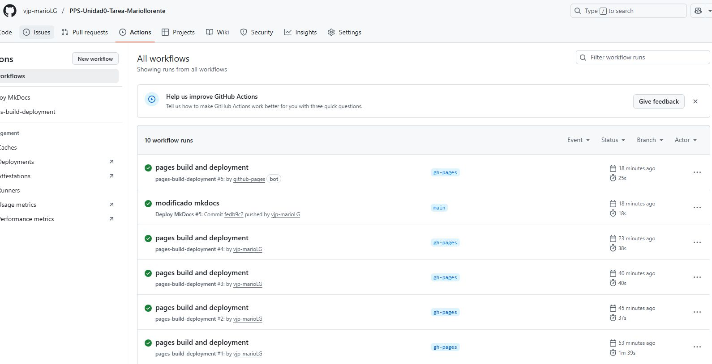

# PPS-Unidad0-Tarea-Mariollorente

# 1. Creación del repositorio en GitHub

Accede a GitHub y crea un nuevo repositorio con esta nomenclatura:  
**PPS-Unidad0-Tarea-Mariollorente**

Añade como colaborador al profesor:  
Ve a **Settings > Collaborators** y agrégalo (usuario: **PPSvjp**).

---

# 2. Estructuración del repositorio

Configura la estructura base del repositorio con las siguientes carpetas y archivos recomendados:

---

# 3. Documentación de cada fase en Markdown

Cada apartado de la tarea debe estar documentado en un archivo específico y vinculado desde el índice principal `index.md`.

Por ejemplo:

- **git.md**: Explica y justifica todos los comandos usados para la creación y gestión del repositorio.
- **gitActions.md**: Documenta el proceso del workflow y cómo automatiza la generación de documentación.
- **gitPages.md**: Detalla la configuración y vinculación de GitHub Pages para publicar la documentación.
- **docker.md**: Explica el despliegue de NGINX con Docker para servir la documentación localmente.
- **conclusiones.md**: Recoge tus reflexiones finales sobre la tarea.

---

# 4. Creación y configuración de MkDocs

Inicializa MkDocs en el repositorio (`mkdocs.yml`) y configura las secciones vistas antes.  
Modifica la sección **site_name** para personalizar tu proyecto.

---

# 5. Desarrollo del Workflow con GitHub Actions

Crea un workflow (`.github/workflows/CreacionDocumentacion.yml`) que, tras cada *push*, genere automáticamente la documentación con MkDocs.  
Este workflow debe publicar los archivos en la rama **gh-pages**.

---

# 6. Configuración y activación de GitHub Pages

Activa GitHub Pages en la configuración del repositorio, apuntando a la rama **gh-pages**.  
Verifica que la documentación se publique correctamente y copia el enlace final al archivo de entrega.

---

# 7. Contenedor NGINX con Docker

Levanta un contenedor NGINX que sirva la documentación generada por MkDocs.

Opciones:  
- Docker directo  
- Dockerfile  
- docker-compose  

Cumpliendo siempre:

- Nombre del contenedor: **PPSUnidad0-TareaTunombre**
- Exponer el puerto **8085** en tu máquina anfitriona
- *Bind-mount* de la carpeta del repositorio como volumen

---

# 8. Documentación visual y evidencias

Adjunta capturas de pantalla a pantalla completa que muestren tu nombre de usuario visible (en terminal o plataforma), incluyendo:

- Creación del contenedor Docker  
- Visualización de la web en el puerto 8085  
- Resultado del comando `docker inspect` sobre el contenedor

