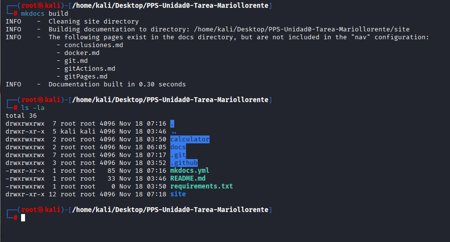

# Publicación local con un contenedor NGINX

En esta sección se explica la creación de un contenedor Docker con NGINX para servir la documentación generada por MkDocs.

---

## 1. Preparación

La documentación generada por MkDocs se encuentra en la rama: gh-pages

Se accede a ella con:

```bash
git fetch
git checkout gh-pages
```
---

## 2. Creación del contenedor NGINX con bind mount

---


- Comando utilizado:

```bash
docker run -d \
  --name PPSUnidad0-Mariollorente \
  -p 8085:80 \
  -v $(pwd):/usr/share/nginx/html \
  nginx
```
- Explicación:

-p 8085:80 → El servicio NGINX queda disponible en http://localhost:8085.

-v $(pwd):/usr/share/nginx/html → Se monta la carpeta del repositorio dentro del contenedor.

nginx → Imagen oficial.

---

## 3. Comprobación del servicio

Una vez en ejecución, se puede acceder a la documentación con: http://localhost:8085


---

## 4. Inspección del contenedor


```bash
docker inspect PPSUnidad0-Tarea_Mariollorente
```
De esta forma se obtiene información detallada: puertos, volúmenes, rutas internas y estado del contenedor.

---

## 5. Detener y eliminar el contenedor (opcional).

```bash
docker stop PPSUnidad0-Tarea_Mariollorente
docker rm PPSUnidad0-Tarea_Mariollorente
```

---

## Conclusion
La creación del contenedor NGINX ha permitido comprobar de forma práctica cómo puede desplegarse una aplicación web estática utilizando Docker. Aunque la documentación ya se encuentra publicada en GitHub Pages, este ejercicio demuestra la importancia de conocer los fundamentos del despliegue mediante contenedores, especialmente en entornos donde es necesario reproducir servicios de manera rápida, aislada y coherente.

Mediante el uso de un bind mount, se logró servir directamente los archivos generados por MkDocs desde la rama gh-pages, lo que facilita un flujo de trabajo flexible y totalmente reproducible. Además, la configuración del puerto y la inspección del contenedor permiten comprender aspectos clave como el mapeo de red, los volúmenes y la estructura interna del servicio.

En definitiva, este apartado refuerza el aprendizaje sobre Docker y su papel dentro de un entorno DevSecOps, mostrando cómo una herramienta de contenedorización puede integrarse fácilmente en procesos de documentación, despliegue y pruebas locales.


[def]: ../img/img15.jpg