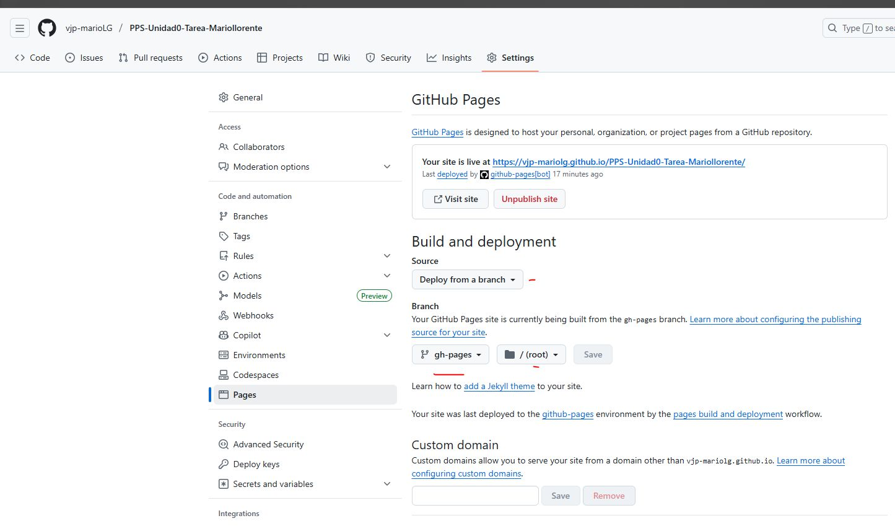
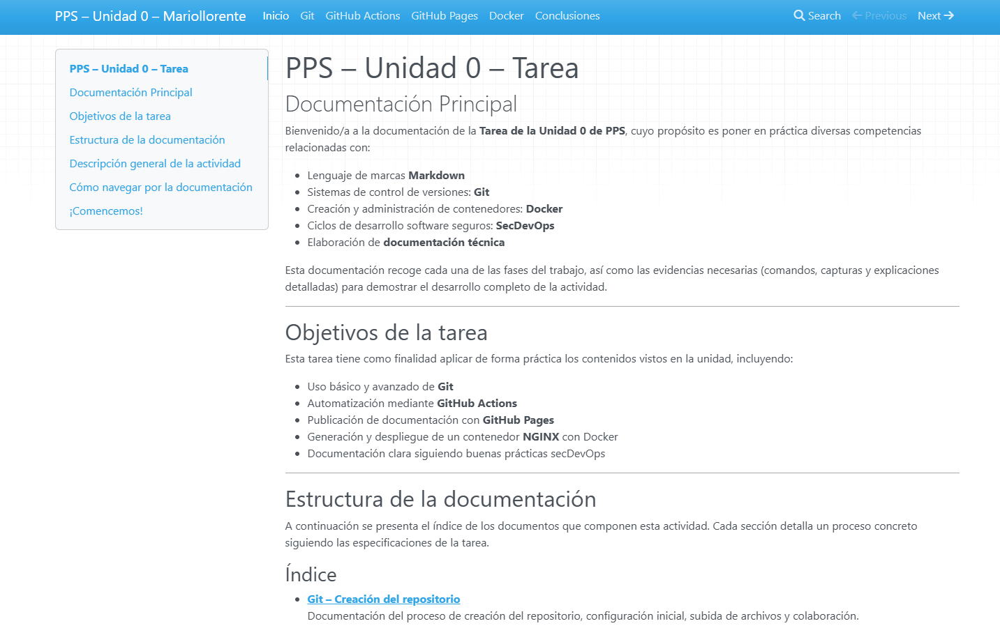

# Publicación de la documentación con GitHub Pages

Este documento explica cómo se habilitó GitHub Pages para mostrar la documentación generada por MkDocs.

---

## 1. Activación de GitHub Pages

En el repositorio: Settings > Pages:

Se configuró:

- Source: **Deploy from a branch**
- Branch: **gh-pages**
- Folder: **/**

Tras guardar, GitHub proporciona la URL pública para la documentación:

https://vjp-MarioLG/PPS-Unidad0-Tarea-Mariollorente

---

## 2. Verificación del despliegue

El sitio muestra:

- Índice (`index.md`)  
- Las páginas enlazadas desde `mkdocs.yml`  
- Menú lateral generado por MkDocs Material  
- Documentación actualizada automáticamente mediante GitHub Actions

---

## 3. Flujo completo de publicación

1. Escribo o modifico documentos Markdown.  
2. Hago push al repositorio.  
3. GitHub Actions construye la documentación.  
4. La rama `gh-pages` se actualiza.  
5. GitHub Pages publica la web automáticamente.  

Es un proceso completamente automatizado.

---

## Conclusión

La configuración de GitHub Pages ha permitido publicar la documentación de manera automatizada y accesible desde cualquier lugar, sin necesidad de servidores adicionales. Gracias a la integración con la rama gh-pages y el workflow de GitHub Actions, el proceso de despliegue se convierte en una tarea completamente transparente: cada actualización en el repositorio se refleja de forma inmediata en la web pública.

Este apartado demuestra la utilidad de GitHub Pages como herramienta para alojar documentación técnica, proyectos educativos y contenido estático de forma gratuita y confiable. Su simplicidad de configuración, unida al poder de automatización de GitHub Actions, aporta un flujo de trabajo moderno y eficiente que encaja perfectamente dentro de un enfoque DevSecOps.

En resumen, GitHub Pages es una solución eficaz, rápida y segura para la publicación continua de documentación, y constituye una parte fundamental del ciclo completo trabajado en esta actividad.
